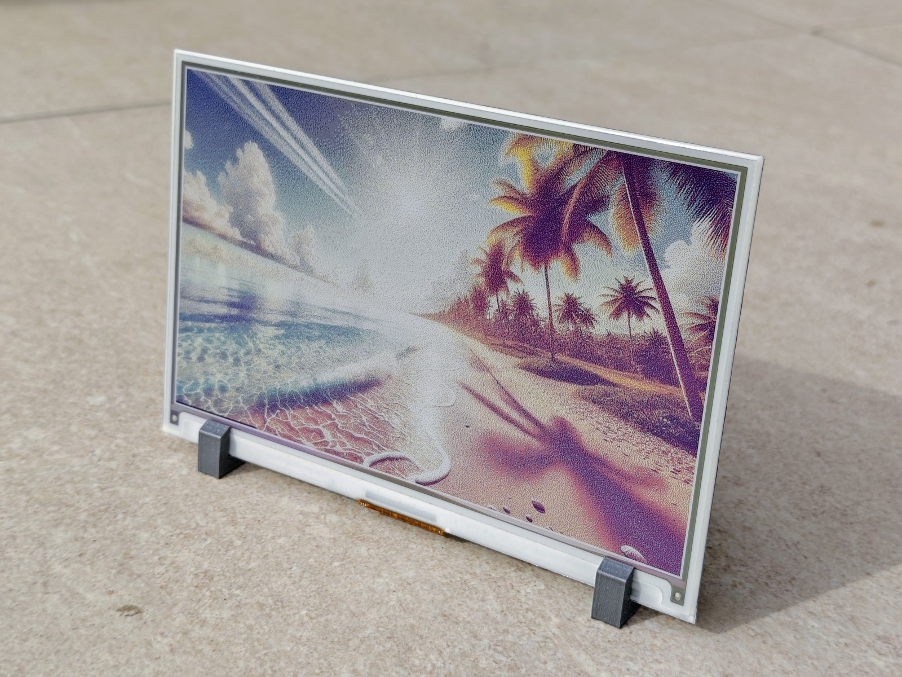
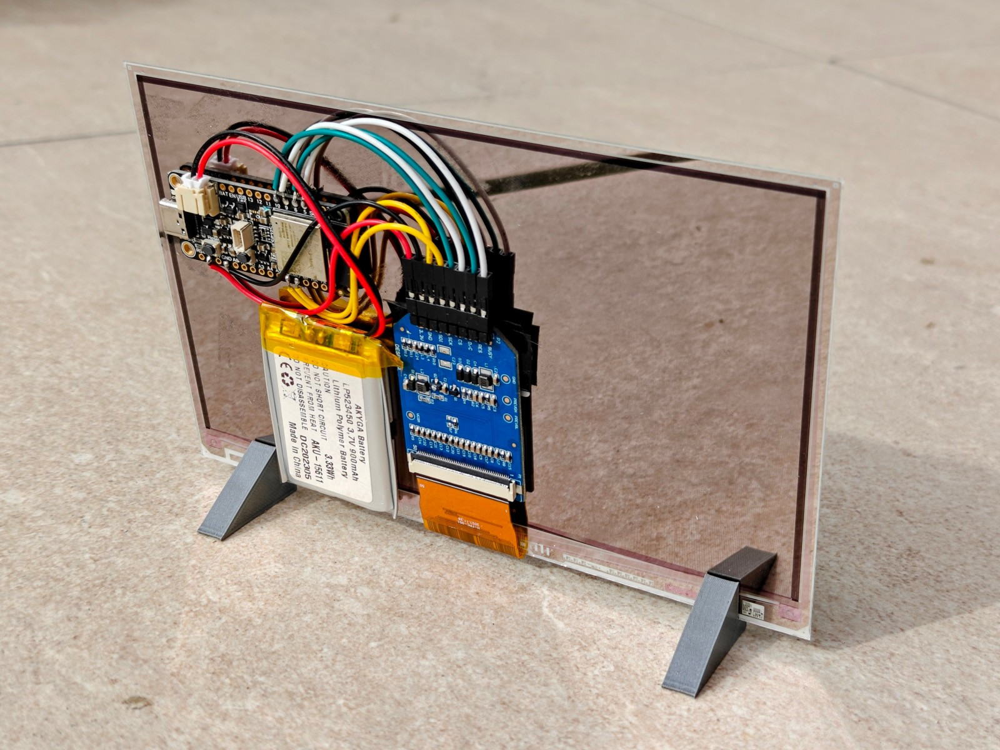

# DIY E-Ink Photo Frame

This repository shows how to turn color e-ink display into a personal digital photo frame and provide all the necessary code. The final result is shown below, the frame will randomly cycle about ten photos of your selection. E-ink displays still have some limitations, so the visual quality is not stellar (low pixel resolution and small set of colors that can be displayed), however it is a nice and relatively inexpensive DIY project (around 100 USD total). With a small battery, the frame will run even several months on a single charge. All the components can be bought on Aliexpress or from another sellers and everything can be put together in a few hours. All code is just in python.

## Components

### Display

You need 7.3 inch full color e-ink display:

- [Good Display GDEY073D46](https://www.good-display.com/product/442.html) - older ACeP version, supporting 7 colors, might not be in stock anymore. [AliExpress](https://www.aliexpress.com/item/1005005671413173.html), [Laskakit](https://www.laskakit.cz/good-display-gdey073d46-7-3--800x480-epaper-barevny-displej/) (local Czech seller I typically use)
- [Good Display GDEP073E01](https://www.good-display.com/product/533.html) - newer Spectra E6 version, faster refresh, but support only 6 colors. [AliExpress](https://www.aliexpress.com/item/1005007253583430.html), [Laskakit](https://www.laskakit.cz/good-display-gdep073e01-7-3--800x480-epaper-barevny-displej/).

In addition, you need a connection adapter board that handles the serial communication between the display and microcontroller:
- [Epaper HAT Connection Adapter Board](https://www.buyepaper.com/products/epaper-hat-connection-adapter-board-for-073-inch-e-ink-display-despi-c73-648) - it is identical for both displays. [AliExpress](https://www.aliexpress.com/item/1005005671328036.html), [Laskakit](https://www.laskakit.cz/good-display-despi-c73-univerzalni-spi-e-paper-adapter/)

Both displays are very similar and almost identical code works for both of them. They are very thin (sub 1mm), so it adds to photo-like feel. The picture above features GDEY073D46 (the older ACeP version, Advanced Color ePaper) - it has resolution 800x480 pixels and can display black, white, yellow, orange, red, green and blue colors. The newer GDEP073E01 has the same resolution, cannot display orange (so images look slightly less warm - tbh I slightly prefer the older look, especially for faces, but the difference is really small) and it has much faster refresh (it takes about half a minute of blinking to change an image on the older version, compared to about 10 seconds on the newer one). The faster refresh might mean also much longer battery life (as the power is needed only when refreshing and switching the images), but I did not compare this directly.

### Controller

I used [Adafruit Feather ESP32-S3](https://www.adafruit.com/product/5477) (product id 5477). Many others can be likely used as well, this one has several nice features:
- Good support for CircuitPython
- USB-C for flashing and charging
- JST-PH on board for connecting battery (the controller handles the charging)
- The controller can behave as external storage when connected to computer - photos can be copied easily

[AliExpress](https://www.aliexpress.com/item/1005007532295735.html), [Botland CZ](https://botland.cz/desky-kompatibilni-s-arduino-adafruit/21579-feather-esp32-s3-wifi-gpio-modul-4-mb-flash-2-mb-psram-kompatibilni-s-arduino-adafruit-5477.html)

### Battery

Any battery with 3.7V and JST-PH connector should work. I used LiPol battery with 900 mAh and it lasted for 2-3 months on a single charge with changing the images every 2 hours. The battery is the heaviest component, you can also opt for the smaller 500 mAh one.

- LiPol battery 603048 900mAh 3.7V - [AliExpress](https://www.aliexpress.com/item/32921358236.html), [Laskakit](https://www.laskakit.cz/ehao-lipol-baterie-603048-900mah-3-7v/)

### Standing feet

3D printed, based on the [standing_feet.scad](standing_feet.scad) OpenSCAD file.

### Others

Some jumper wires with female connector on one end (commonly used with breadboard) and the soldering equipment. It is very easy soldering, I had basically none experiece with it before - only needed to connect the other end of wires to the controller. Alternatively you can use controller with headers and just connect everything with female-female wires, without any soldering at all (but you might not be able to attach everything to the back of the frame).

## Tutorial

1. Preparing photos
2. Connecting the controller and the display
3. Flashing the code to the controller
4. Optionally, printing the standing feet

### 1. Preparing photos

As the resolution is only 800x480 and the display can use only a limited set of colors, all photos has to be cropped, resized and converted to an appopriate color palette. All of this is handled by [prepare_photos.py](prepare_photos.py) Intended to run with normal Python 3 on computer, `pyproject.toml` contains the dependencies for poetry. The script processes all photos stored under `photos` folder and saves the transformed photos in `ready` folder. The display uses 4 bits for every pixel (to directly encode six or seven colors). It is a bit wasteful, as only 3 bits should be actually needed - but it allows to store 2 pixels in every byte, so it is more convenient to work with. I do not use any compression, so every transformed photo is exactly 400 x 480 = 192 000 bytes, so you can store 10 of them on the controller. The transformed photos have the same names as the originals and use `.bin` suffix, as they just store the images in their binary representation directly.

After connecting the controller to the computer, it should appear as a storage device (after pressing `reset` button on the controller) and the photos should be just copied there under `img` folder.

**If you have the newer GDEP073E01 display, use [spectra/prepare_photos.py](spectra/prepare_photos.py) instead!** It does not use orange color and encode other colors slightly differently, so the photos have to be transformed slightly differently.

### 2. Connecting controller and display

Adapter board has 8 pins that need to be connected to corresponding pins on the controller by wires:

- 3.3V and GND should be connected to 3V and GND on the controller
- SDI and SCK to pins for SPI interface on the controller: SCK should be directly there, SDI correspond to MOSI (or just MO on small controllers)
- the rest - CS (chip select), D/C (data / command), RES (reset), BUSY - to any digital pins. I used 10, 9, 6 and 5 respectively (the exact pins are defined in the code for the controller).

I just cut the wire, removed a part of the plastic and soldered it directly to appropriate pins. Connecting the battery to the controller and the display to the adapter board is straightforward. I attached everything to the back of the display with thick two-sided tape (intended for bathroom tiles originally).

### 3. Code for the controller

Everything is stored under the folder `controller`. The `lib` subfolder contains required libraries for SPI serial communication and for checking the battery state for this particular controller, all is available on the internet.

The Adafruit 5477 controller can be programmed with [CircuitPython](https://circuitpython.org) and [Thonny](https://thonny.org) is a very convenient IDE to use for it. It can directly flash the controller with CircuitPython and then run the code on the controller, even with REPL. So after flashing CircuitPython, the content of the folder `controller` should be just copied into the controller.

All the custom code is in [controller/code.py](controller/code.py) file and mo of it is direct translation of original C++ code provided by the manufacturer (the initialization sequences). Then the controller checks all files within `img` subfolder, selects one of them at random and sends it to the controller. In addition, the state of the battery is checked and it is shown at the bottom of the frame as black line ("no black line" = battery is full; "black line over the whole lenght of the frame" = battery is empty). The battery status is only appoximate, but I still find it useful and inobtrusive.

After displaying the picture, the controller goes to sleep and wakes up again in 1 hour to display another picture. As the display does not require any power for showing the picture, only for changing them, the battery can last for weeks and months.

**If you have the newer GDEP073E01 display, use [spectra/code.py](spectra/code.py) instead of the version in `controller` folder!** There is one small change in the initalization sequence.

### 4. Standing feet

They are defined with open-source [OpenSCAD](https://openscad.org) 3D modeller in [standing_feet.scad](standing_feet.scad) file. You can just export them for 3D printing and then continue according to 3D printer that you have available. I used OpenSCAD as it allowed all the modelling to be handled in code and my requirements were very simple.

And that's it, enjoy!
